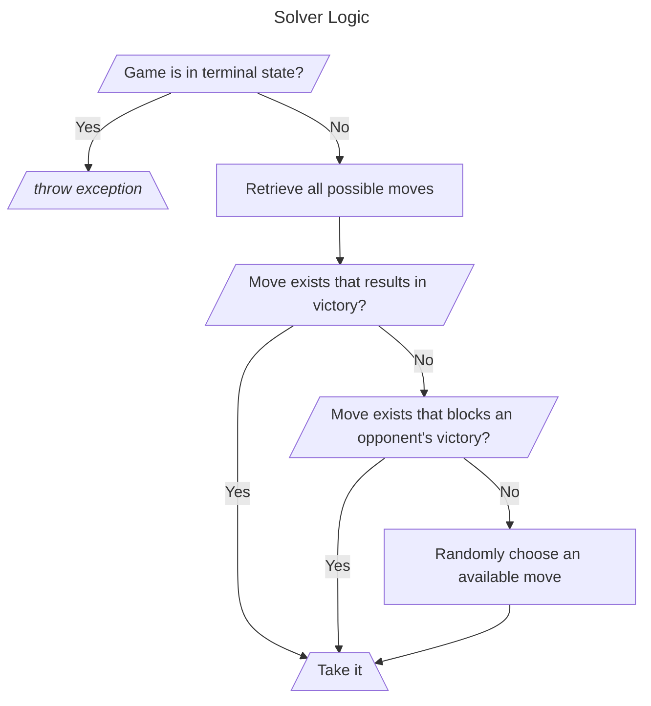

# "Connect Crab" Game


## Background

There is a game featured in a video game titled "Lost in Play" found on [Steam Marketplace](https://store.steampowered.com/app/1328840/Lost_in_Play/).

The game is played on what seems like a traditional chess board but with size 6x6, and with crabs instead of tokens (befitting for the nautical theme at this point in the game).
The object of the game is to move your color of crabs into a continuous row of 4 before your opponent is able to accomplish it for himself.

When playing this game, it is required to beat the seagull opponent in this mini-game, in order to proceed with the story of the real game.
I found this rather difficult, so I decided to create this application to decide the best move given any situation.

The game is initialized as follows:

with you playing as the red crabs, and your opponent playing as blue.

```
│Θ1│  │Ψ1│Θ2│  │Ψ2│ 
│  │  │  │  │  │  │
│Ψ3│  │  │  │  │Θ3│
│Θ4│  │  │  │  │Ψ4│
│  │  │  │  │  │  │
│Ψ5│  │Θ5│Ψ6│  │Θ6│
```

You always play first in the game, so an example of possible moves involve any that move a red crab in a direction that allows at least one space of movement:

* `Ψ1` down (_4 spaces_)
* `Ψ1` left (_1 space_)
* `Ψ2` down (_1 space_)
* `Ψ2` left (_1 space_)
* `Ψ3` up (_1 space_)
* `Ψ3` right (_4 spaces_)
* `Ψ4` down (_1 space_)
* `Ψ4` left (_4 spaces_)
* `Ψ5` up (_1 space_)
* `Ψ5` right (_1 space_)
* `Ψ6` up (_4 spaces_)
* `Ψ6` right (_1 space_)

As you can see, each of the 6 crabs the user has in the initial board set up has 2 moves it can make for a total of 12 possible leading moves. (Many of which are isometrically identical accounting for the rotation of the board, but this isn't that important to the puzzle, it is just an observation.)

Of course, some of these moves, especially as the game progresses, are more advantageous than others as they get someone closer to victory.

## Current Solver Implementation

The following is the strategy the existing solver will employ to determine its next move suggestion:



## How to use

To use the solver, build the jar, and run it on the command line.

```sh
mvn clean package
java -jar target/connect-crab-solver.jar
```

* Performs the first move that the solver recommends
    * Perform the move that is told to you from the tool exactly, because this iteration of the tool does not account for mistakes. There is no correcting the board configuration in the event of a mis-input move into the game.
* Then, input the move the opponent made to progress the state of the board and prompt the solver to calculate the next optimal move.
    * A move input requires identifying the piece number and the direction in which the piece should move separated by a space:
        ```
        > 4 L
        ```
* Repeat until victory! (Or until failure, in which case there is work to do on the solver…)

### Note on performance

It should be noted, I didn't work very hard on the artificial intelligence for this tool.
However, it was powerful enough for me to win on my first try.
Feel free to submit suggestions that would improve the performance of the solver.
